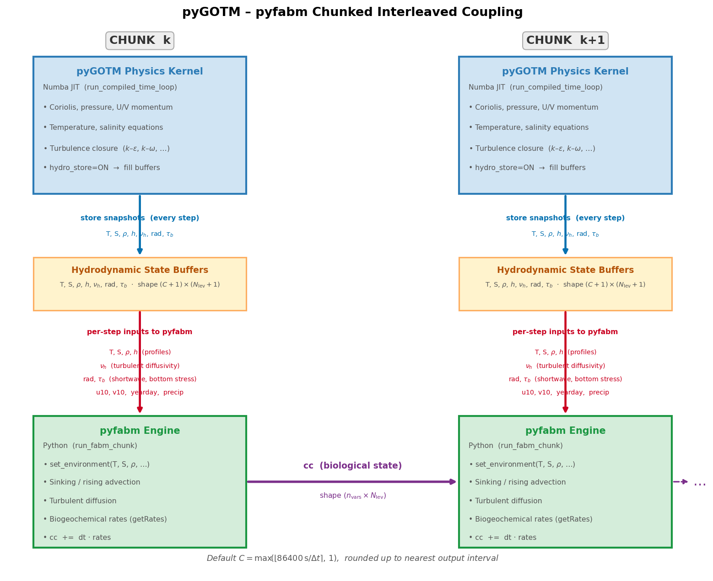

Biogeochemistry and FABM Coupling
===================================

pyGOTM integrates biogeochemical modelling through the Framework for Aquatic
Biogeochemical Models (FABM) via its Python front-end, **pyfabm**.  The
coupling enables any FABM-compatible biogeochemical or ecological model to run
within a pyGOTM single-column simulation without modifying the pyGOTM physics
kernel.

What is FABM?
--------------

FABM (Framework for Aquatic Biogeochemical Models) is an open-source,
model-agnostic coupling framework that allows biogeochemical models to be
compiled once and coupled to different physical ocean and lake models without
code changes.  Each FABM model describes:

* **State variables** — concentrations of biogeochemical quantities (e.g.
  phytoplankton, dissolved oxygen, nutrients).
* **Source/sink rates** — the net production or consumption of each state
  variable due to biological reactions, chemistry, and air-sea exchange.
* **Dependencies** — physical environment fields that the biogeochemical model
  needs from the host (temperature, salinity, light, density, etc.).
* **Diagnostics** — derived quantities the model exposes back to the host
  (e.g. light attenuation, chlorophyll *a*).

**pyfabm** is the Python binding to the FABM shared library.  It exposes the
FABM model described in a ``fabm.yaml`` configuration file as a
``pyfabm.Model`` object whose state arrays, rates, diagnostics, and
dependencies can be read and written from Python.  A wide range of models are
available — from simple nutrient-phytoplankton-zooplankton (NPZ) models to
complex biogeochemical models such as ERSEM and HBM-NEMO-PISCES.

Enabling FABM in pyGOTM
------------------------

FABM is activated by adding a ``fabm`` block to the GOTM YAML configuration:

.. code-block:: yaml

   fabm:
     use: true
     config_file: fabm.yaml     # path to the FABM model YAML, relative to gotm.yaml
     freshwater_impact: true    # dilute/concentrate tracers with precipitation
     repair_state: false        # clamp negative concentrations to zero

   feedbacks:
     shade: false               # allow FABM to modify light attenuation
     albedo: false              # allow FABM to modify surface albedo
     surface_drag: false        # allow FABM to modify surface drag

The ``config_file`` key (also accepted as ``config``, ``yaml``, or ``file``)
points to the FABM model YAML that specifies which biological models are
active.  If not supplied, the default ``fabm.yaml`` in the same directory as
``gotm.yaml`` is used.

The coupling is completely optional.  If ``fabm.use: false`` (the default),
the physics-only compiled Numba loop runs unchanged and pyfabm is never
imported.

.. _fabm-coupling-design:

Coupling Architecture: Chunked Interleaved Loop
------------------------------------------------

A fundamental constraint drives the design of the coupling:

    **Numba-compiled kernels cannot call back into Python**, and pyfabm is
    a Python-level library.  They cannot be interleaved at the sub-timestep
    level.

The solution adopted in pyGOTM is a **chunk-based sequential coupling** that
interleaves physics and biogeochemistry at the granularity of *chunks* —
contiguous windows of timesteps large enough to amortise the Python overhead
while short enough to maintain tight coupling between the physical environment
and the biological state.

Chunk size
~~~~~~~~~~

The default chunk size is approximately **one day of simulation time**:

.. math::

   N_\mathrm{chunk} = \max\!\left(
       \left\lfloor \frac{86400\,\mathrm{s}}{\Delta t} \right\rceil, 1
   \right),

where :math:`\Delta t` is the physics timestep in seconds.  This is then
rounded up to the nearest multiple of the output interval so that output
boundaries are always aligned between physics and biogeochemistry.

The chunk size can be overridden by passing ``chunk_size`` to
:func:`~pygotm.gotm.gotm.integrate_gotm_compiled`.  There is a natural
trade-off:

* **Smaller chunks** — lower memory for the hydrodynamic state buffers, but
  more Python overhead.
* **Larger chunks** — less Python overhead, but larger scratch arrays (shape
  ``(N_\mathrm{chunk}+1) \times (N_\mathrm{lev}+1)``).  Memory grows as
  approximately :math:`7 N_\mathrm{chunk} N_\mathrm{lev}` doubles (``float64``
  arrays for T, S, ρ, h, nuh, radiation, and bottom stress).
* **One-day default** — balances memory and overhead across typical
  timesteps of 60–600 s.

The chunk size has *no impact on numerical accuracy* for the biological
equations — the biogeochemistry is advanced at the same timestep :math:`\Delta t`
as the physics within each chunk; chunking only determines how often the stored
hydrodynamic snapshots are refreshed.

Per-chunk execution sequence
~~~~~~~~~~~~~~~~~~~~~~~~~~~~~

Each chunk proceeds as follows:

.. code-block:: text

    ┌─────────────────────────────────────────────────────────────┐
    │  CHUNK k  (timesteps i = k·C … k·C + C − 1)                │
    │                                                             │
    │  1.  PHYSICS PASS (Numba JIT)                               │
    │      ─────────────────────────                              │
    │      run_compiled_time_loop(nt=C, hydro_store=ON)           │
    │      → advance T, S, U, V, k, ε by C steps                 │
    │      → store snapshots of T, S, ρ, h, nuh, rad, τ_b        │
    │        at every step  (hydro buffers, shape C+1×nlev+1)     │
    │                                                             │
    │  2.  FABM PASS (Python)                                     │
    │      ─────────────────────────                              │
    │      run_fabm_chunk(hydro_T, hydro_S, …, cc_in)            │
    │      for step = 0 … C:                                      │
    │        a. set_environment(T[step], S[step], ρ[step], …)     │
    │        b. sinking/rising advection  (adv_center)            │
    │        c. turbulent diffusion       (diff_center)           │
    │        d. biogeochemical rates      (engine.get_rates)      │
    │        e. apply source/sink rates   (cc += dt · rates)      │
    │      → returns updated biological state cc                  │
    └─────────────────────────────────────────────────────────────┘

The biological state ``cc`` (shape ``n_vars × nlev``) is passed from one chunk
to the next as a direct argument, providing continuity.

   **Figure** — Chunked interleaved coupling between the pyGOTM Numba physics
   kernel and the pyfabm biogeochemical engine.  Each chunk runs the full
   physics for :math:`N_\mathrm{chunk}` timesteps, stores snapshots of the
   hydrodynamic state, then drives pyfabm through those same timesteps.
   Variables exchanged at each step are shown as labelled arrows.

Variables Exchanged
-------------------

pyGOTM → pyfabm (dependencies)
~~~~~~~~~~~~~~~~~~~~~~~~~~~~~~~~~

At every biogeochemical timestep, pyGOTM sets the following FABM dependencies
from the stored hydrodynamic snapshots:

.. list-table::
   :header-rows: 1
   :widths: 40 15 45

   * - FABM dependency name
     - Shape
     - Source in pyGOTM
   * - ``temperature``
     - ``(nlev,)``
     - Potential temperature :math:`\theta` [°C] — stored snapshot
   * - ``practical_salinity``
     - ``(nlev,)``
     - Practical salinity :math:`S` [psu] — stored snapshot
   * - ``density``
     - ``(nlev,)``
     - In-situ density :math:`\rho` [kg m⁻³] — stored snapshot
   * - ``cell_thickness``
     - ``(nlev,)``
     - Layer thicknesses :math:`h_i` [m] — stored snapshot
   * - ``downwelling_photosynthetic_radiative_flux``
     - ``(nlev,)``
     - PAR profile [W m⁻²] — computed from radiation snapshot, updated after
       light-feedback
   * - ``surface_downwelling_photosynthetic_radiative_flux``
     - scalar
     - Surface PAR [W m⁻²] — top-of-column value
   * - ``wind_speed``
     - scalar
     - Wind speed :math:`|\mathbf{u}_{10}|` [m s⁻¹] from (u10, v10) forcing
   * - ``number_of_days_since_start_of_the_year``
     - scalar
     - Fractional day of year (yearday + secondsofday / 86400)
   * - ``bottom_stress``
     - scalar
     - Bottom friction velocity :math:`\tau_b` [Pa] — stored snapshot

Dependencies that are not exposed by the particular FABM model are silently
skipped.  A call to ``engine.unresolved_dependencies()`` reports any required
dependencies that have not been set after initialization.

pyfabm → pyGOTM (feedbacks and diagnostics)
~~~~~~~~~~~~~~~~~~~~~~~~~~~~~~~~~~~~~~~~~~~~~

.. list-table::
   :header-rows: 1
   :widths: 40 15 45

   * - FABM diagnostic / output
     - Shape
     - Effect in pyGOTM
   * - ``attenuation_coefficient_of_photosynthetic_radiative_flux`` (or ``kc``)
     - ``(nlev,)``
     - Bio-shading: modifies the PAR profile fed back to FABM at the next
       rates call within the same timestep (light-feedback loop)
   * - Source/sink rates (all state variables)
     - ``(n_vars, nlev)``
     - Applied to biological concentrations: ``cc += dt * rates``
   * - Surface exchange rates
     - ``(n_vars, nlev)``
     - Added only to the top layer (index ``−1``) as air-sea exchange
   * - Bottom exchange rates
     - ``(n_vars, nlev)``
     - Added only to the bottom layer (index ``0``) as sediment flux
   * - Vertical movement velocities
     - ``(n_interior, nlev)``
     - Sinking or rising advection before the diffusion/reaction step

Within-Chunk FABM Timestep
---------------------------

Each biological timestep within a chunk applies the following operations in
order, which exactly mirrors the sequence used by ``gotm_fabm.F90`` in the
reference Fortran GOTM implementation:

1. **Set environment** — copy the stored hydrodynamic snapshots into pyfabm
   dependencies (temperature, salinity, density, cell thickness, PAR, wind,
   year-day, bottom stress).

2. **Vertical advection** (sinking/rising) — interior state variables with
   non-zero vertical movement velocities are advected using the conservative
   P2-PDM scheme (``adv_center``) with zero-flux boundary conditions at top
   and bottom.  Face velocities are computed by thickness-weighted interpolation
   of cell-centre velocities to interfaces, replicating lines 1161–1199 of
   ``gotm_fabm.F90``.

3. **Turbulent diffusion** — each interior state variable is diffused
   vertically using the implicit Crank–Nicolson solver (``diff_center``) with
   the turbulent diffusivity :math:`\nu_h` from the stored hydrodynamic
   snapshot.  Precipitation dilution is applied as a Neumann surface boundary
   condition:
   :math:`F_\mathrm{surf} = -c_{n,\mathrm{sfc}} \cdot \text{precip}`.

4. **Biogeochemical rates** — pyfabm ``getRates()`` is called *after* the
   transport step so that reaction rates act on the post-transport concentrations.
   The rates are retrieved three times with different surface/bottom flags to
   separate bulk, surface, and bottom contributions:

   .. code-block:: text

      bulk_rates  = engine.get_rates(surface=False, bottom=False)
      surf_rates  = engine.get_rates(surface=True,  bottom=False)
      bot_rates   = engine.get_rates(surface=False, bottom=True)

5. **Light feedback** — if ``attenuation_coefficient_of_photosynthetic_radiative_flux``
   is exposed by the model, the PAR profile is recomputed from the
   biological attenuation and fed back into FABM before a second rates call
   within the same timestep.  This two-pass approach captures the immediate
   effect of phytoplankton self-shading on the light available for growth.

6. **Apply rates** — concentrations are updated:

   .. math::

      c_i^{n+1} = c_i^n
      + \Delta t \cdot R_i^\mathrm{bulk}
      + \Delta t \cdot \delta_{i,\mathrm{top}}
        \left(R_i^\mathrm{surf} - R_i^\mathrm{bulk}\right)\big|_\mathrm{top}
      + \Delta t \cdot \delta_{i,\mathrm{bot}}
        \left(R_i^\mathrm{bot}  - R_i^\mathrm{bulk}\right)\big|_\mathrm{bot},

   where surface and bottom exchange contributions are concentrated in the
   top and bottom cells respectively.  Surface and bottom state variables
   (e.g. sediment fractions exposed by some FABM models) are updated
   separately from their single-layer rate arrays.

PAR Profile and Light Feedback
-------------------------------

The downwelling photosynthetically active radiation (PAR) at cell-centre depth
:math:`z_k` is computed from the surface radiation snapshot using a
two-component exponential attenuation:

.. math::

   I_k = I_0 (1 - A) \exp\!\left(-\frac{z_k}{g_2} - K_\mathrm{bio}(z_k)\right),

where :math:`I_0` is the surface shortwave, :math:`A` is the fraction absorbed
in the first attenuation component (``light_A``), :math:`g_2` is the
background attenuation depth scale (``light_g2``), and
:math:`K_\mathrm{bio}(z_k) = \sum_{k'=k}^{N} k_{c,k'} \Delta h_{k'}`
is the cumulative biological attenuation integrated downward from the surface
using the ``kc`` (or
``attenuation_coefficient_of_photosynthetic_radiative_flux``) diagnostic
exposed by the FABM model.

When ``light_g2 ≤ 0``, light feedback is disabled and the PAR profile is
the stored GOTM radiation profile unchanged.

Memory Layout
--------------

The hydrodynamic state buffers allocated once per integration are

.. list-table::
   :header-rows: 1
   :widths: 15 25 60

   * - Array
     - Shape
     - Content
   * - ``hydro_T``
     - ``(C+1, nlev+1)``
     - Temperature snapshots (bottom→top, index 0 = initial condition)
   * - ``hydro_S``
     - ``(C+1, nlev+1)``
     - Salinity snapshots
   * - ``hydro_rho``
     - ``(C+1, nlev+1)``
     - Density snapshots
   * - ``hydro_h``
     - ``(C+1, nlev+1)``
     - Cell-thickness snapshots
   * - ``hydro_nuh``
     - ``(C+1, nlev+1)``
     - Turbulent diffusivity snapshots
   * - ``hydro_rad``
     - ``(C+1, nlev+1)``
     - Shortwave radiation snapshots (PAR source)
   * - ``hydro_taub``
     - ``(C+1,)``
     - Bottom stress snapshots (scalar per step)

Row 0 of each buffer holds the state at the *start* of the chunk (or the
initial condition on the first chunk).  Rows 1…C hold the state *after* each
physics timestep.  The last column (index ``nlev``) is the surface interface
value.

If the final chunk is smaller than the default chunk size, the buffers are
reallocated to the smaller size so no stale data is used.

See Also
--------

* :doc:`/api/fabm` — full FABM module API reference (FABMConfig, FABMEngine, coupling, fabm_loop)
* :doc:`overview` — global solution sequence and where biogeochemistry fits
* :doc:`airsea` — surface forcing that provides wind and radiation to the coupling
